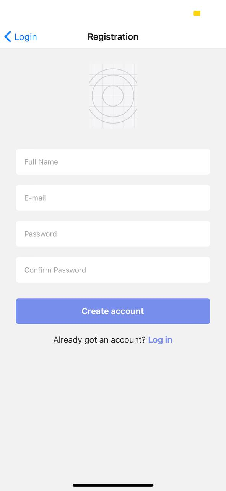
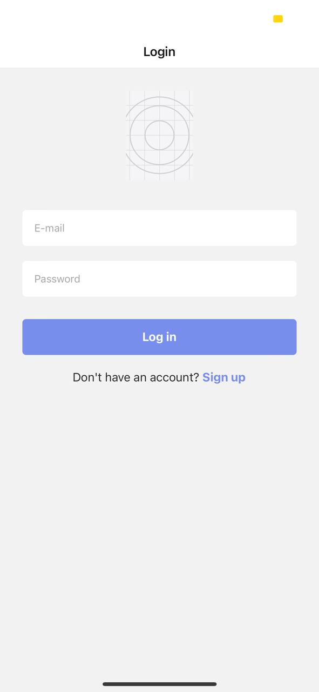
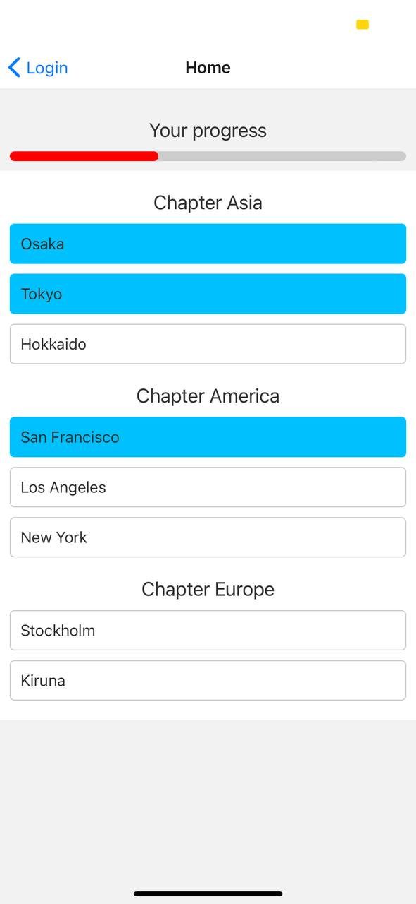

## LearnNow

LearnNow is a mobile app with a simple authentication module that displays a list of contents divided into
chapters. Users are able to see their respective progress in the app based on the number of completed section.

This app contains a few key features backed by Fireabase support:

- Registration with E-mail & Password
- Login with E-mail and Password
- Navigation (react-native-navigation) between Homepage and sections of each chapter
- Displaying of progress bar based on the number of sections completed
- Local save of progress so that users can pick up where they left off when they re-login to the application

## Getting Started (with Expo)

If you are using Expo Cli, clone the repo and run "expo start" in the root folder of the project:

```
git clone https://github.com/chriswengqi/LearnNow.git
cd LearnNow
npm install
expo start
```

## Simple Walkthrough

<br>

**Registration Screen**



<br>

Registration Screen for users to register their account. Developed using the Firebase SDK.

<br>

**Login Screen**



<br>

Users who have registered their account can login via this page. If authentication is successful, they will be brought to their respective home page.

<br>

**Home Screen**



<br>

Home Screen that displays sections divided into each chapter. After each section is completed, the ListItem changes to blue color to indicate that the chapter is completed. The progress bar in red is updated to show the progress of the user.

<br>

**Chapter Screen**


Screen for each chapter displaying an image and some text. Scrollable

## Extra Features

When users logout, their progress will be saved locally. When they relogin to the app, they will still be able to see their completed sections.

## In Progress

Users should be able to pickup where they left off when they relogin to the app.
